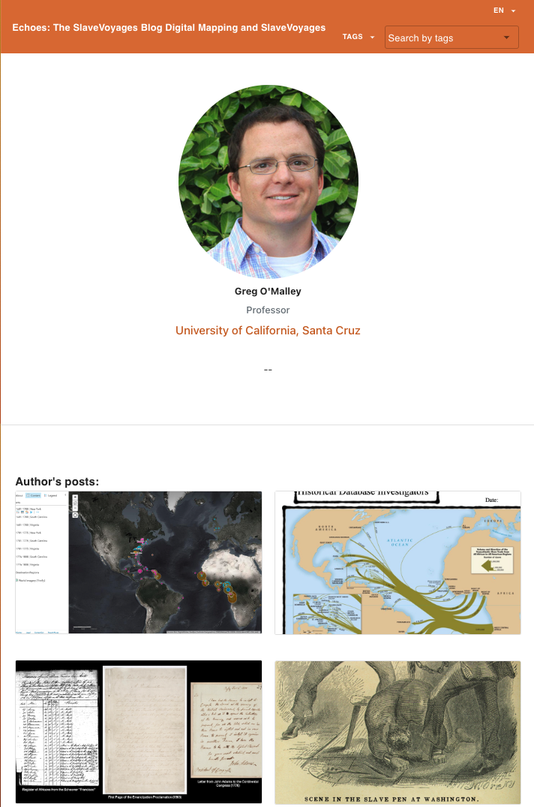

# Author

The Author component is responsible for displaying information about an author, including their name, role, institution, and a list of their blog posts.

We have includes each components in author

## AuthorPost

The `AuthorPost` component is responsible for displaying authors information and post list.

## AuthorInfo

The `AuthorInfo` component is responsible for displaying information about an author, including their name, role, institution, and a list of their blog posts.

## AuthorPostList

The `AuthorPostList` component is responsible for displaying a list of blog posts written by an author.

#

