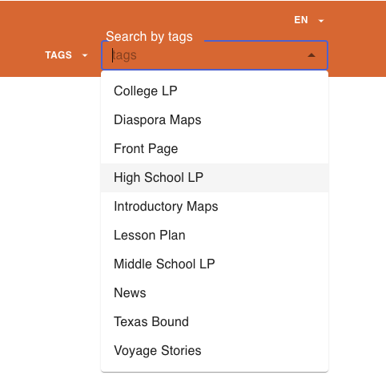

# AutoCompletedSearhBlog

`AutoCompletedSearhBlog` is a React component designed to create a dropdown menu that allows users to select search options related to blog posts. This component provides a button that, when clicked, opens a menu containing a list of search options. Users can select an option from the menu to perform a specific search action. This README documentation explains the purpose of the component and provides guidance on how to use it within your React application.

#

