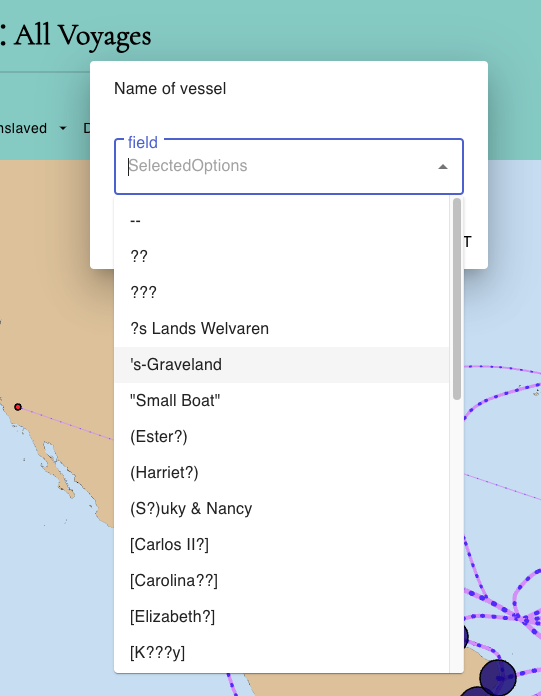

# AutoComplete

`Autocomplete` is responsible for rendering an autocomplete input field that allows users to search for and select multiple options.
Here's a breakdown of what this component does:

#

- Imports necessary dependencies for the component.
- Manages component state and lifecycle using React hooks.
- Fetches autocomplete suggestions via HTTP requests using Redux actions.
- Stores and updates selected autocomplete values in state.
- Handles user input changes.
- Retrieves and sets previously selected values from local storage.
- Provides an autocomplete input field using Material-UI components.
- Triggers actions and updates Redux state when users select values.
- Renders the autocomplete input field with Material-UI styling.
  Uses props and state values to control behavior and integrates with the Redux store for application-wide state management.

In summary, Autocomplete is a reusable React component that encapsulates the functionality of an autocomplete input field with dynamic suggestions and selected values handling. It is used to filter and search for specific data in the application.

#

