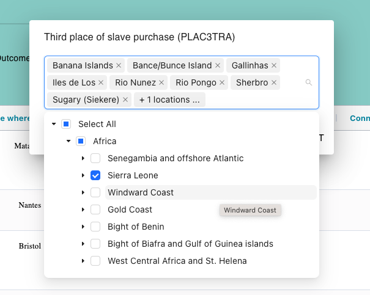

# GeoTreeSelected

`GeoTreeSelected`. It is responsible for rendering a tree-select component and managing the selection of geographical tree values in a web application.
Here's a concise explanation of what this component does:

#

- Imports necessary libraries.
- Sets up component state using React hooks.
- Retrieves data from the Redux store.
- Loads selected values from local storage.
- Fetches and updates geographical tree data.
- Handles user selections.
- Renders a user-friendly tree-select interface.

#

In summary, the `GeoTreeSelected` component serves as a user interface element for selecting and managing geographical tree values in the application. It interacts with Redux for state management, updates the UI based on user input, and communicates with the server to fetch data as needed.

