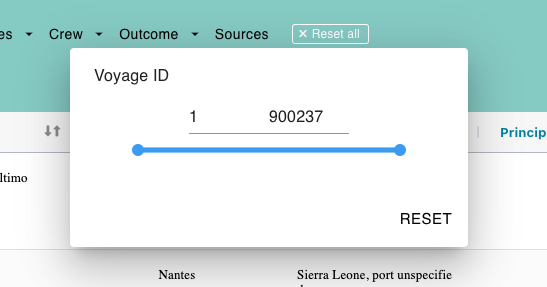

# Range Slider

The `Range Slider` allows users to select a range of values within a specified minimum and maximum range. The component also includes input fields for directly entering the start and end values of the range.
It connects to Redux for state management, fetches data based on the path name, updates and stores filter settings, and renders the UI components using Material-UI.

In summary, this component handles the user interface for a range slider with various settings, fetching initial data, and persisting user selections in local storage.

#

