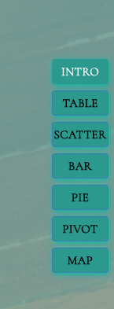
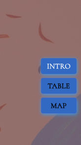
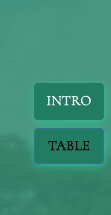

# CollectionTab

`CollectionTab` that renders navigation buttons. Users can click these buttons to switch between different sections of a web application.
It uses Redux to manage the current page and applies dynamic styling to the buttons based on the current page and application style.

### CollectionTabVoyages

- 

### CollectionTabEnslaved

- 

### CollectionTabEnslavers

- 
