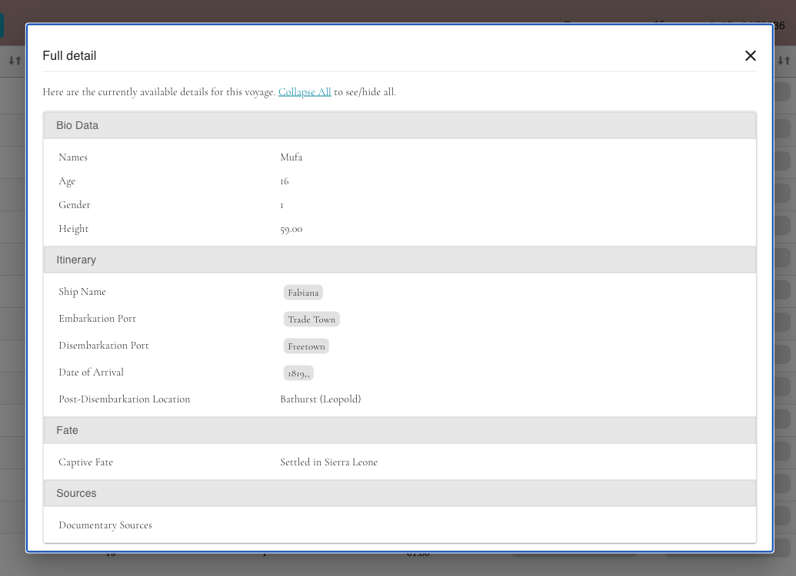

# Card

The bar Graph component is responsible for displaying a bar graph using the Plotly.js library. It fetches data from an API and allows the user to customize the graph by selecting different options and variables.

#

- 
