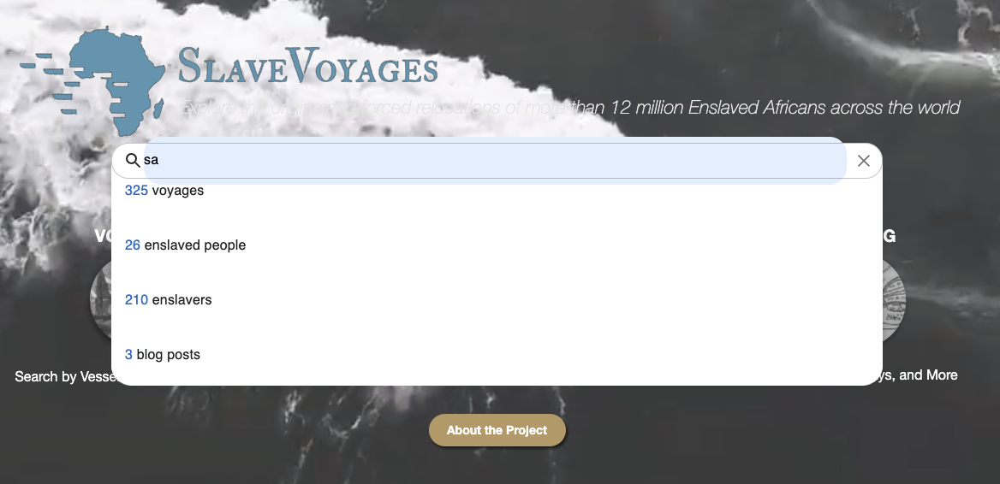

# Global Search

The `Global Search ` that will handles global search functionality, including fetching and displaying search results based on user input, using Redux for state management. It provides a user-friendly interface for navigating to different sections of the application, allowing users to search for voyages, enslaved people, enslavers, and blog posts by typing in the search bar, and clicking on the results directs them to the respective pages."

#

- 
