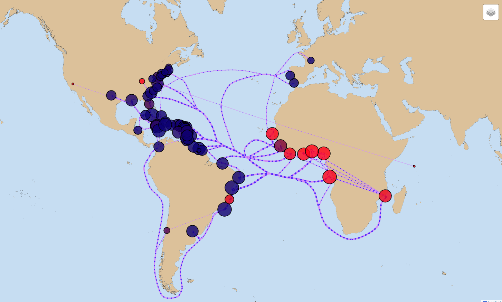

# Map

The `Map components` consist of the LeafletMap Component, which manages map rendering, data fetching, zoom control, and styling, and the NodeCurvedLinesMap Component, responsible for retrieving, rendering, and animating nodes, edges, and curved lines on the map based on data from the Redux store. The code retrieves and visualizes data from the Redux store, dynamically calculates node size and color, creates animated curved lines between nodes using D3.js, and renders circle markers with pop-up content, all while updating the map based on the data.

#

- 
