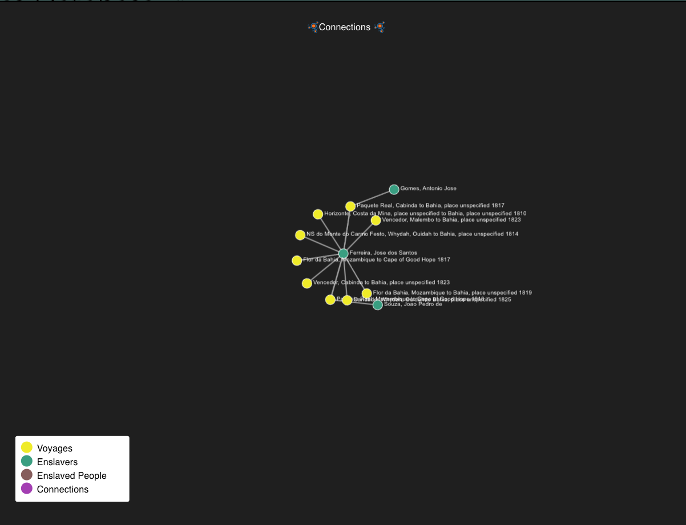

# Network Graph

The Network Graph component is a React component designed for visualizing network diagrams using D3.js within a canvas element.
This component allows you to render nodes and edges representing entities and connections in a network. Users can interact with the network diagram, including zooming, dragging, and clicking on nodes.

#

We provide components to work on as follow

- The `drawNetwork` function is a JavaScript function responsible for rendering a network diagram on an HTML5 Canvas element. It accepts various parameters, including canvas context, dimensions, node and edge data, transformations, and additional options. This documentation provides an overview of the function, its purpose, and usage.

- The `findHoveredEdge` function is a JavaScript function designed to identify and retrieve information about an edge (connection) in a network diagram that is currently being hovered over by the mouse cursor. This function is commonly used in applications that visualize network data, such as graphs, social networks, or data visualizations. This documentation provides an overview of the function, its purpose, and usage.

- The `findNode` function is a JavaScript utility function designed to identify and retrieve information about a node (element) in a network diagram that is currently located within a specified proximity to a given point. This function is commonly used in applications that visualize network data, such as graphs, social networks, or data visualizations. This documentation provides an overview of the function, its purpose, and usage.

- The `ModalNetworksGraph` component is a React component designed to display a modal window containing a network diagram of people and their connections. It integrates with Material-UI for styling and Redux for state management. This documentation provides an overview of the component, its features, usage, and dependencies.

- The `NetworkDiagram` that uses D3.js to visualize network diagrams on a canvas. It lets you display nodes and edges to represent entities and connections in a network. Users can interact with the diagram by zooming, dragging, and clicking on nodes. This documentation explains the component's purpose and usage. Its primary goal is to create interactive network diagrams for visualizing connections.

- The `NetworkDiagramSlaveVoyages` component is a React component designed to display a network diagram related to past networks, such as enslaved individuals and their connections. It integrates with various data sources, Redux for state management, and a network diagram visualization component. This documentation provides an overview of the component, its features, usage, and dependencies.

- The `ShowsAcoloredNodeKey` component is a React component that provides a key or legend for interpreting the colored circles used in a network visualization. This key helps users understand the meaning of different colors used to represent various elements or categories within the network diagram. This documentation provides an overview of the component, its purpose, and usage.

