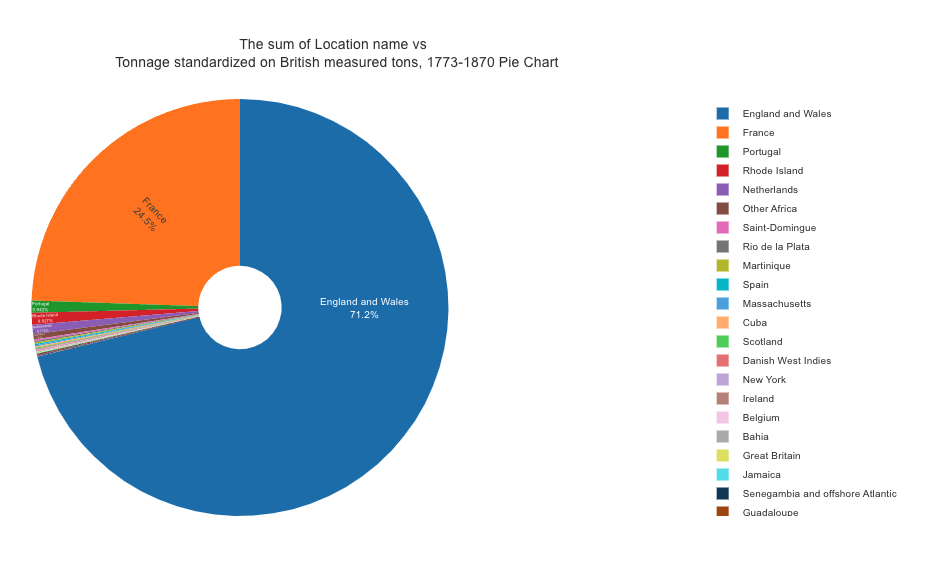

# Pie Graph

The Pie Graph component is a React component that displays a pie graph using Plotly.js library. It allows users to select options for the X and Y variables, choose an aggregation function, and visualize the data in a pie chart.

#

- 
