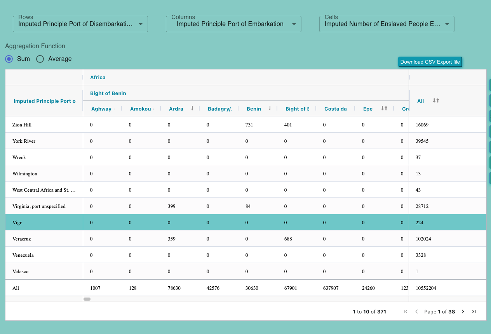

# Pivot Table

The `PivotTables` component is a React component designed for displaying and interacting with pivot tables using the ag-Grid library. This component is part of a larger application and serves the purpose of rendering pivot tables with various customization options.

You can customize the `PivotTables` component by making changes to the Redux state, utility functions, and constants utilized within the component. Additionally, you have the flexibility to style the component by modifying the CSS classes and styles applied in the component's JSX.

- 
