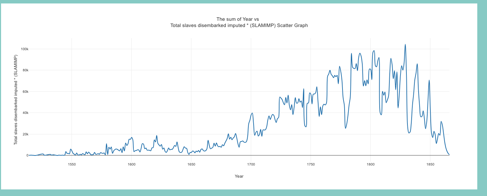

# Scatter Graph

The Scatter component is a React component that displays a scatter graph using the Plotly.js library. It fetches data from an API and allows users to customize the graph by selecting different option

#

- 
