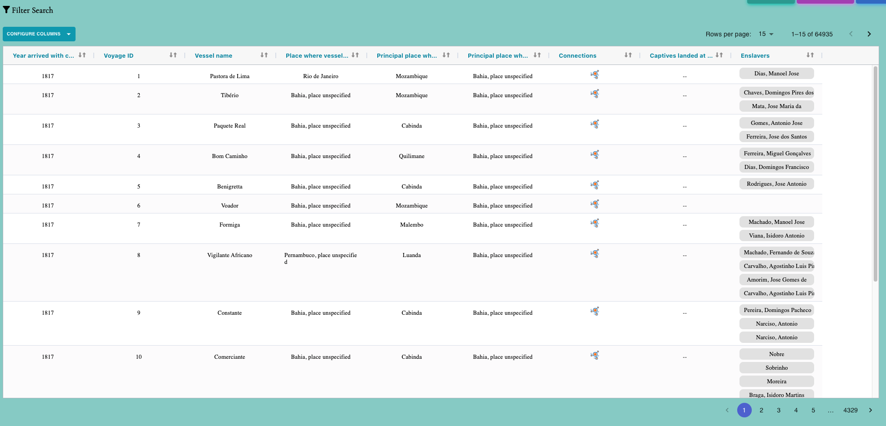

# Table Components

The `Table Components` is a React-based table component designed for displaying and interacting with data related to voyages. It uses the Ag-Grid library to provide a feature-rich and highly customizable table for displaying data. This component also interacts with various Redux state variables to manage and display data, including filtering, pagination, and column visibility.

#

In the table need GenerateCellTableRenderer to display information on the table
The `GenerateCellTableRenderer` function is a utility function designed for use in Ag-Grid tables within a React application. It is responsible for rendering cell content based on the provided parameters and cell function (cellFN). The function allows for custom rendering of cell values and handles user interactions, such as opening modals or triggering actions.

- 
