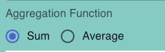

# Aggregation Sum Average

The `"Aggregation Sum Average" `component lets you choose between two aggregation options: sum and average. It uses components like FormControl, RadioGroup, FormControlLabel, and Typography from MUI to handle these choices and show an alert when necessary.

The component's logic involves managing which aggregation option you've selected, showing an alert if the showAlert prop is set to true, and reacting to changes when you pick an aggregation option.

