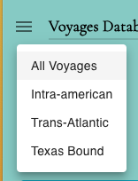

# Drop Down

- `DropdownColumn` is a React component that provides a dropdown functionality. It renders a trigger element and a menu that can be opened and closed.
  

#

- The `LanguagesDropdown` component is a React component that provides a dropdown menu for selecting languages. It interacts with Redux to manage language selection and rendering. This documentation will guide you through the usage and functionality of this component.

  

#

- The `MenuDropdown` component is a React functional component that represents a dropdown menu. It utilizes the StyledMenu component from the stylesMenu/StyledMenu module.

  
