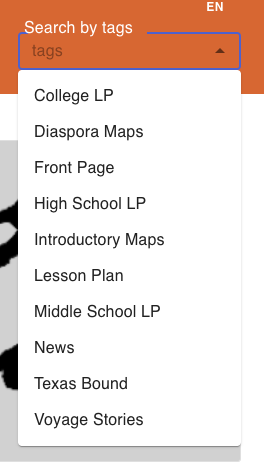
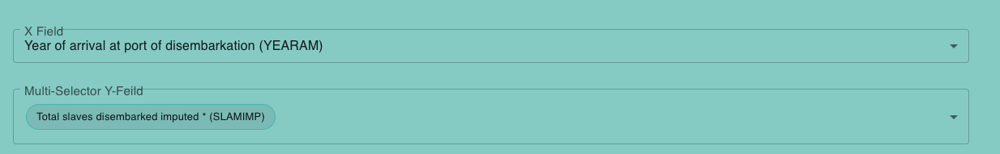
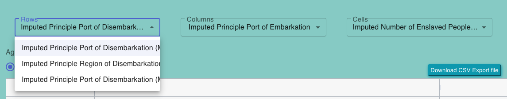

# Select Dropdown

- `SelectBlogDropdown` is a React component designed to create a dropdown menu that allows users to select search options related to blog posts. This component provides a button that, when clicked, opens a menu containing a list of search options. Users can select an option from the menu to perform a specific search action.

#

The `SelectBlogDropdown` component is a custom dropdown menu used for selecting options and variables in a scatter plot graph, bar graph or pie graph. It is implemented using the Material-UI library.

#

The `SelectDropdownPivotable` component is a React-based component that provides a user interface for selecting options related to pivot tables. It includes dropdown menus for selecting rows, columns, and cells for pivot table configurations. This component is typically used in conjunction with pivot table functionality.

