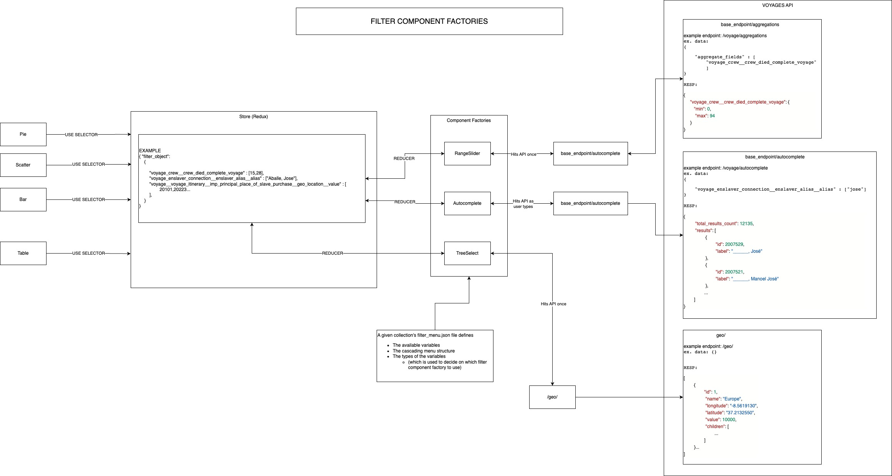

# Components

## Introduction

Welcome to the Slave Voyages Application Components README. This document provides an overview of the various components that make up the Slave Voyages Application, which is designed to provide historical information about the transatlantic slave trade. This documentation will help developers understand the architecture, functionality, and usage of each component in the application.

In our application, we have organized components into two five categories:

##

All components, in one way or another, interact with the Redux store. This allows, for instance, filter components (like the rangeslider) to update the search filter, which triggers the presentation components (like the table) to make a new query and show updated results. Below is a representation of this communication flow.

## Blog Components:

Blog Components play a crucial role in presenting historical narratives, insights, and educational resources to our users. These components are designed to deliver engaging and informative content related to the transatlantic slave trade. Whether it's articles, images, or multimedia, Blog Components are responsible for the presentation and navigation of this valuable information.

##

## Filter Components:

Filter Components focus on presenting filter options and controls.

##

## Navigation Components:

Navigation Components guide users through the application's various sections.

##

## Presentation Components:

Presentation Components handle the visual rendering and layout of information.

##

## Selector Components:

Selector Components enable users to make selections from lists or options.

##

By categorizing our components, we aim to provide developers with a clear understanding of the distinct roles each component plays in our application's architecture. This organization facilitates easier development, testing, and maintenance, allowing us to continuously improve the Slave Voyages Application and deliver a seamless user experience.

Thank you for your interest in our application's components. If you have any questions or require further assistance, please don't hesitate to reach out to our development team.

## Special cases

The following components have some very specific behavior. We describe how the different typescript files in each of those subfolders work on the following documentation pages:

- 
- 
- 
- 
- 
