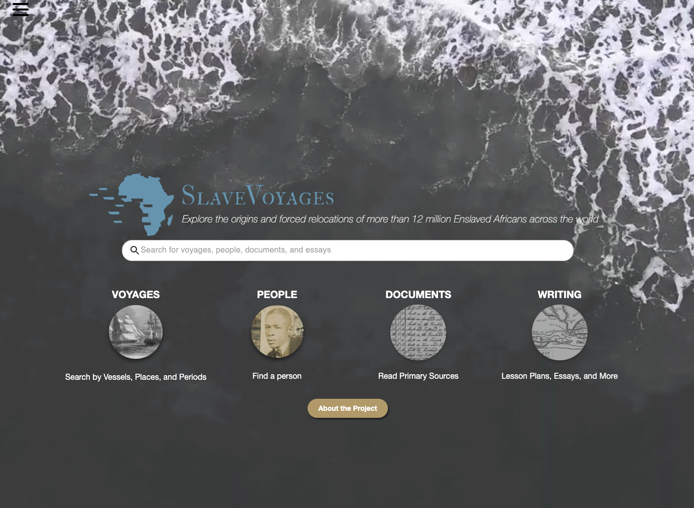
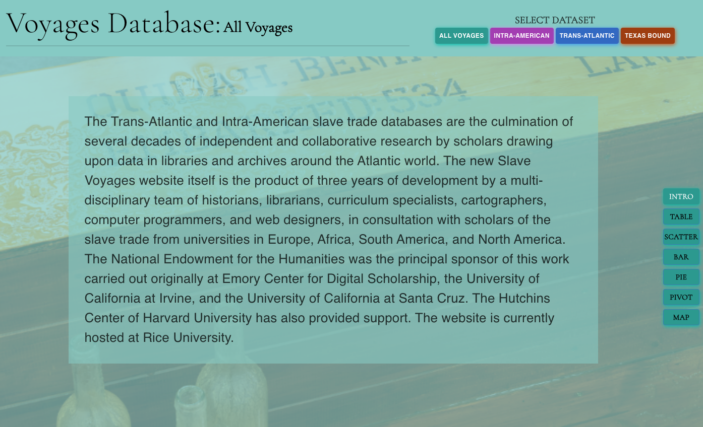
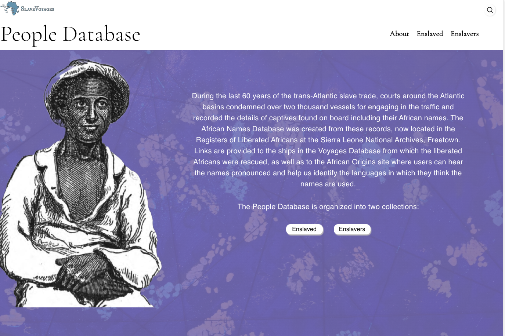
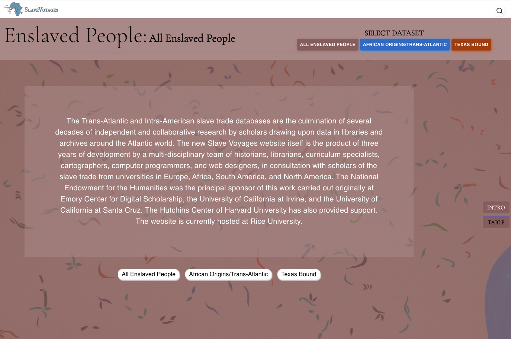
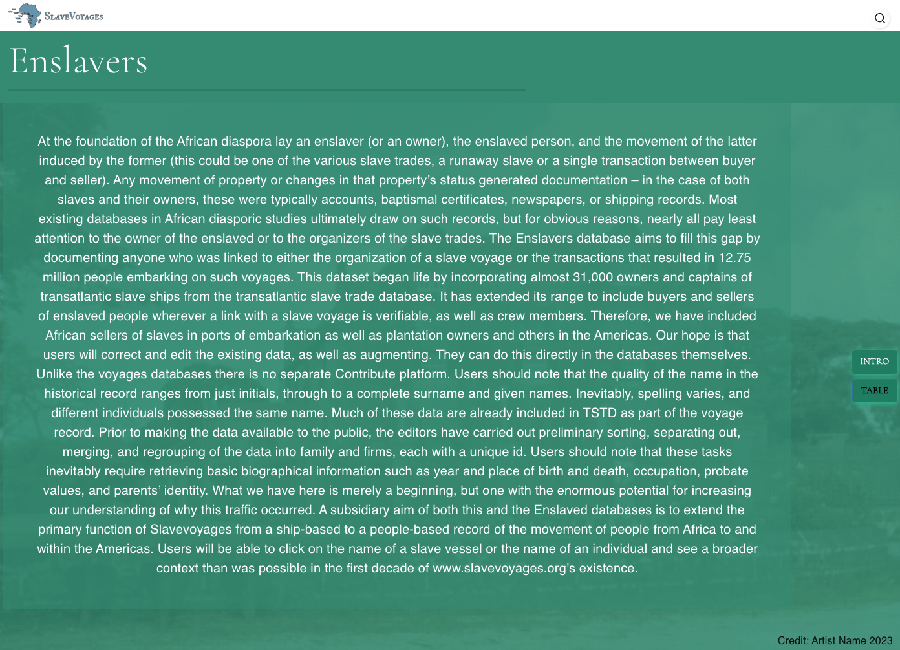
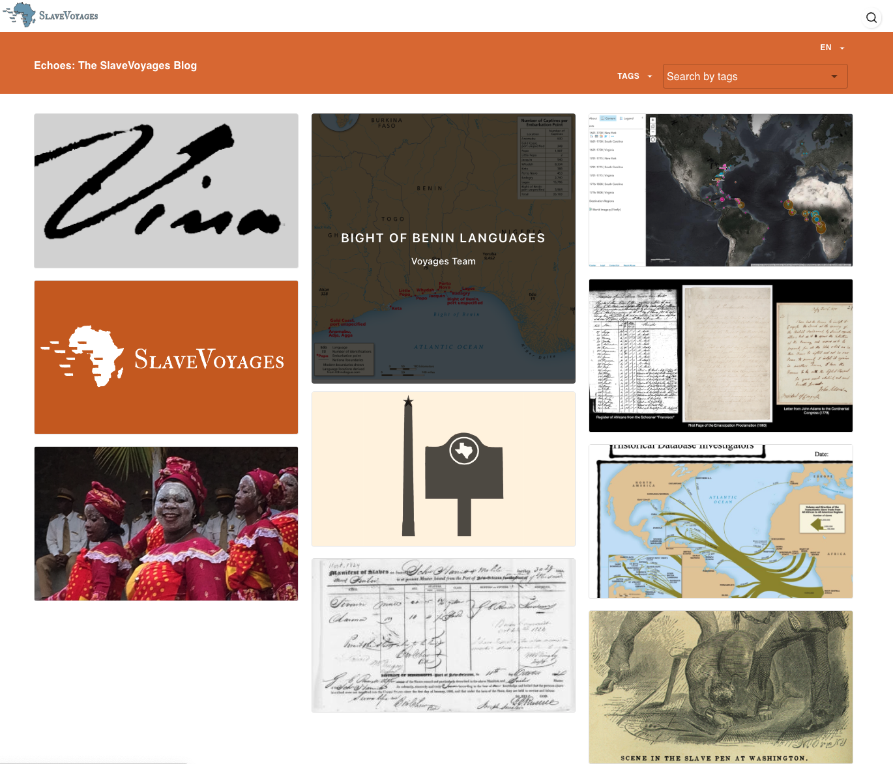
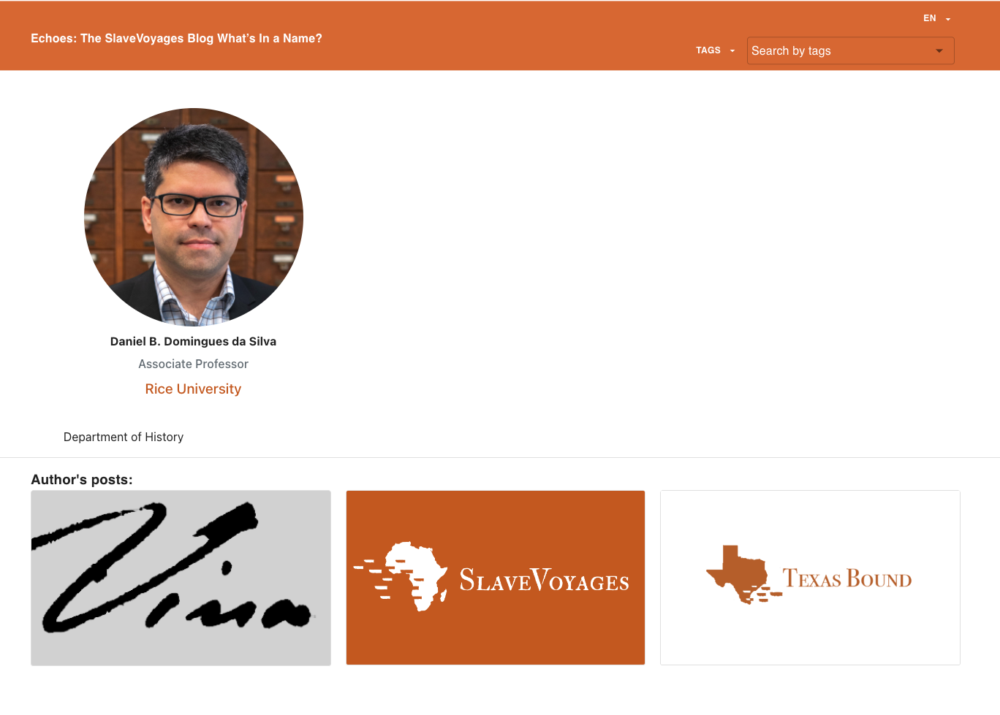
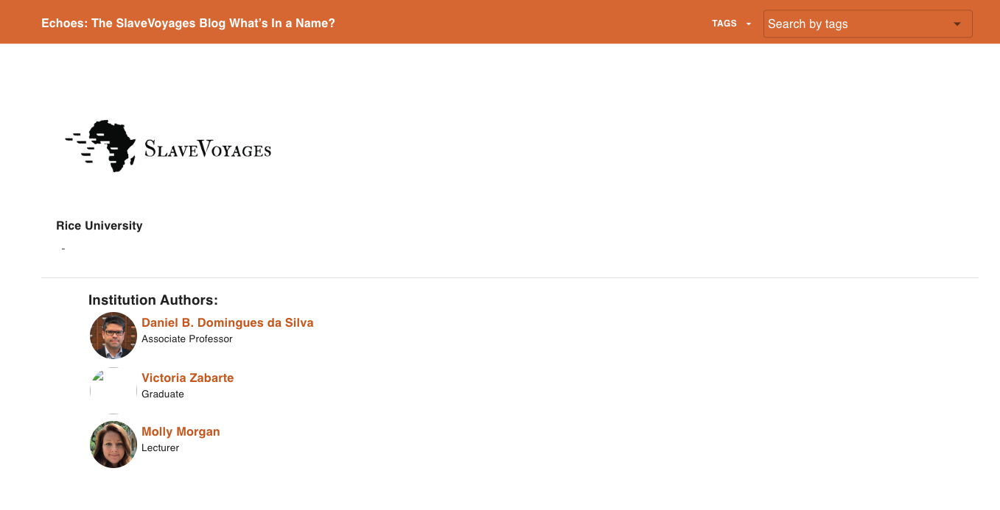
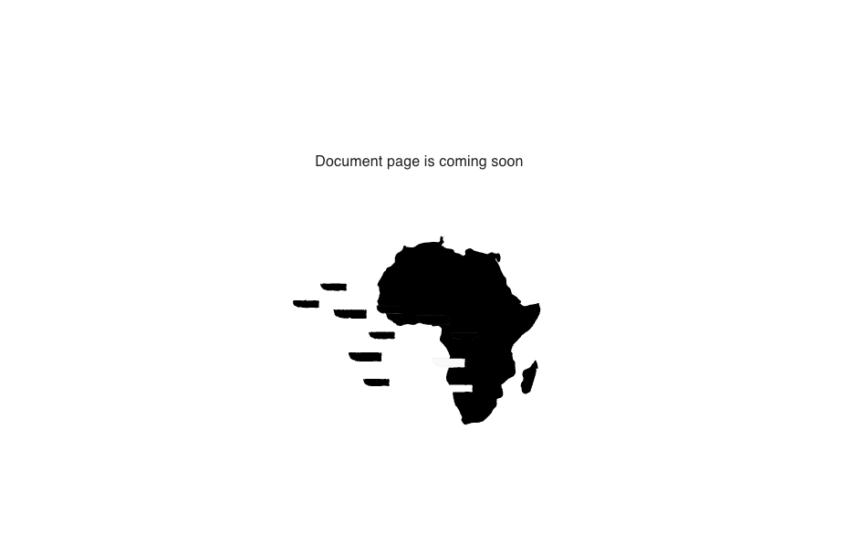

# PAGES

## Introduction

In the context of the Voyages project, the "pages" folder plays a pivotal role as a designated directory for efficiently managing the various routes or views within your application. Each subfolder housed within the "pages" directory aligns with a distinctive page or section featured on your website or web application.

In our Voyages application, we've meticulously structured our pages in the following manner:

##

## Home page

The "Home" page serves as the primary entry point for our application, providing users with an overview of the project and easy access to various sections.

##

## Voyages page

The "Voyages" page is a central feature of our application, allowing users to explore and engage with the core content and functionalities of the Voyages project.

##

## Past page

The "Past" page offers a glimpse into historical events, settings, and contexts, providing valuable insights into the past.

##

## Enslaved page

The "Enslaved" page offers insights and information concerning individuals who were enslaved during historical periods, shedding light on their experiences and histories.

##

## Enslavers page

The "Enslavers" page delves into the stories and profiles of those who played a role in the practice of enslavement throughout history.

##

## Blog page

The "Blog" page is dedicated to blog content, providing users with a space to access and engage with blog posts, articles, or related materials.

##

## Author page

The "Author" page serves as a platform for displaying and exploring details related to authors associated with our project.

##

## Institution authors page

The "Institution Authors" page is designed to showcase authors affiliated with institutions, highlighting their contributions and works.

##

## Documentation page

The "Documentation" page is a resource hub that offers comprehensive documentation and guidance on how to effectively use and navigate our Voyages application.

##

Each of these pages serves a specific purpose within our Voyages application, providing users with a rich and informative experience tailored to their interests and needs.
